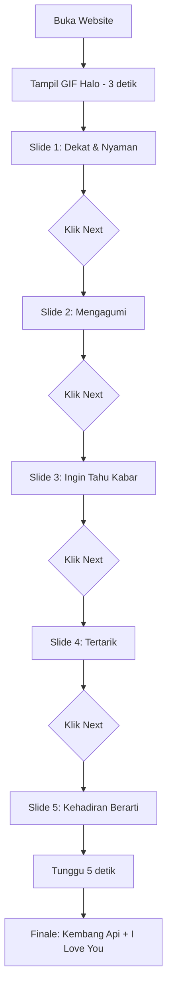

# PDKT Cinta 💙

Website interaktif untuk mengungkapkan perasaan cinta dengan animasi dan efek visual yang menarik.


---

## 📋 Daftar Isi

- [Bahasa Pemrograman & Teknologi](#-bahasa-pemrograman--teknologi)
- [Tampilan Website](#-tampilan-website)
- [Cara Clone Repository](#-cara-clone-repository)
- [Cara Menjalankan](#-cara-menjalankan)
- [Struktur Project](#-struktur-project)
- [Fitur Utama](#-fitur-utama)
- [Cara Kustomisasi](#-cara-kustomisasi)

---

## 💻 Bahasa Pemrograman & Teknologi

### Bahasa yang Digunakan:

| Bahasa | Kegunaan | Persentase |
|--------|----------|------------|
| **HTML5** | Struktur halaman web | ~15% |
| **CSS3** | Styling dan animasi visual | ~25% |
| **JavaScript** | Logika interaktif dan animasi | ~60% |

### Framework & Library:

1. **TailwindCSS** (via CDN)
   - Framework CSS utility-first
   - Digunakan untuk: styling responsif, warna, layout, spacing
   - Tidak perlu instalasi, langsung dari CDN

2. **Font Awesome Pro**
   - Library icon
   - Digunakan untuk: icon panah pada tombol Next
   - Version: 5.x

3. **Canvas API**
   - Native JavaScript API
   - Digunakan untuk: animasi kembang api di layar finale

### Teknologi Tambahan:

- **GIF Animation** - 7 file GIF untuk visual interaktif
- **CSS Keyframes** - Animasi custom untuk pergerakan icon
- **DOM Manipulation** - JavaScript vanilla untuk kontrol elemen
- **Event Listeners** - Interaksi klik dan otomatis

---

## 🎨 Tampilan Website

### 1️⃣ Layar Pembuka (3 detik pertama)
```
┌─────────────────────────────────┐
│   Background: Light Blue        │
│   (#CDE7FF)                     │
│                                 │
│  ┌───────────────────────────┐  │
│  │  Card: Medium Blue        │  │
│  │  (#7BC7FF)                │  │
│  │                           │  │
│  │   [GIF: Halo/Sapaan]      │  │
│  │                           │  │
│  └───────────────────────────┘  │
│                                 │
└─────────────────────────────────┘
```

### 2️⃣ Slide Interaktif (5 tahap)
```
┌─────────────────────────────────┐
│   Background: Light Blue        │
│                                 │
│  ┌───────────────────────────┐  │
│  │  [GIF Romantis]           │  │
│  │                           │  │
│  │  ┌─────────────────────┐  │  │
│  │  │ Pesan Cinta         │  │  │
│  │  │ (Text Putih Bold)   │  │  │
│  │  └─────────────────────┘  │  │
│  └───────────────────────────┘  │
│                                 │
│  ┌───────────────────────────┐  │
│  │   Next  ➡                 │  │
│  └───────────────────────────┘  │
└─────────────────────────────────┘
```

### 3️⃣ Layar Finale (Otomatis setelah 5 detik)
```
┌─────────────────────────────────┐
│   ✨ Kembang Api Warna-warni ✨  │
│  💚 💙 ❤️ 💛 💜 💗             │
│                                 │
│  ┌───────────────────────────┐  │
│  │                           │  │
│  │   [GIF: I Love You]       │  │
│  │                           │  │
│  └───────────────────────────┘  │
│  🎆 Animasi Canvas 🎆          │
└─────────────────────────────────┘
```

**Warna Kembang Api:**
- 🟢 Hijau/Putih
- 🔵 Biru/Cyan  
- 🔴 Merah/Kuning
- 🟣 Ungu/Pink

---

## 📥 Cara Clone Repository

```bash
# Clone repository
git clone https://github.com/username/pdkt_cinta.git

# Masuk ke folder project
cd pdkt_cinta
```

> **Catatan:** Ganti `username` dengan username GitHub Anda

---

## 🚀 Cara Menjalankan

### Metode 1: Buka Langsung di Browser
1. Buka folder `pdkt_cinta`
2. Double-click file `index.html`
3. Website akan terbuka di browser default

### Metode 2: Menggunakan Live Server (Recommended)
1. Buka folder di **VS Code**
2. Install extension **Live Server**
3. Klik kanan pada `index.html`
4. Pilih **"Open with Live Server"**

### Metode 3: Python Simple Server
```bash
# Python 3
python -m http.server 8000

# Buka browser: http://localhost:8000
```

> ✅ **Tidak perlu instalasi dependency** - Website ini 100% statis!

---

## 📁 Struktur Project

```
pdkt_cinta/
│
├── index.html                    # File utama website (HTML + CSS + JS)
│
├── assets/                       # Folder aset visual
│   ├── halo.gif                  # GIF pembuka
│   ├── pelukan.gif               # Slide 1: Dekat & nyaman
│   ├── terkejut.gif              # Slide 2: Mengagumi
│   ├── kabar.gif                 # Slide 3: Ingin tahu kabar
│   ├── tertarik.gif              # Slide 4: Tertarik
│   ├── kehadiranmu.gif           # Slide 5: Kehadiran berarti
│   ├── i_love_you.gif            # Finale: I Love You
│   └── logo_andev-no-name.png    # Favicon/logo
│
└── README.MD                     # Dokumentasi project (file ini)
```

**Total File:** 10 file (1 HTML, 7 GIF, 1 PNG, 1 README)

---

## ✨ Fitur Utama

### 1. **Animasi Pembuka** ⏱️
- Durasi: 3 detik
- GIF sapaan "Halo"
- Transisi otomatis ke slide pertama

### 2. **5 Tahap Perasaan** 💕
Setiap slide berisi:
- GIF animasi romantis
- Pesan cinta dalam bahasa Indonesia
- Tombol "Next" dengan animasi gerak

**Pesan di setiap tahap:**
1. "Aku merasa sangat dekat dan nyaman ketika bersamamu"
2. "Aku sangat mengagumi cara kamu berpikir dan bertindak"
3. "Aku selalu ingin tahu kabar dan keadaanmu"
4. "Aku merasa tertarik dengan semua hal yang kamu lakukan"
5. "Kehadiranmu sangat berarti bagiku"

### 3. **Finale: Kembang Api Interaktif** 🎆
- Animasi kembang api full-screen
- Menggunakan Canvas API
- 4 kombinasi warna berbeda
- Klik layar untuk tambah kembang api
- GIF "I Love You" di tengah

### 4. **Tombol Next Animasi** ➡️
- Icon panah bergerak kanan-kiri
- Animasi CSS keyframes
- Durasi: 4 detik loop

### 5. **Responsive Design** 📱
- Optimal di mobile (320px+)
- Optimal di tablet (768px+)
- Optimal di desktop (1024px+)

---

## 🎨 Cara Kustomisasi

### 1️⃣ Mengganti Pesan Cinta

Edit file `index.html`, cari bagian:
```html
<div class="w-64 font-bold text-white">
    Aku merasa sangat dekat dan nyaman ketika bersamamu
</div>
```

Ganti teks sesuai keinginan.

---

### 2️⃣ Mengganti GIF

**Opsi A:** Ganti file di folder `assets/`
- Gunakan nama file yang sama
- Format: GIF
- Ukuran recommended: 500x500px atau lebih

**Opsi B:** Update path di `index.html`
```html

```
Ganti `halo.gif` dengan nama file baru.

---

### 3️⃣ Mengubah Warna

Edit class TailwindCSS di `index.html`:

| Elemen | Class | Warna Saat Ini |
|--------|-------|----------------|
| Background utama | `bg-[#CDE7FF]` | Light Blue |
| Card | `bg-[#7BC7FF]` | Medium Blue |
| Label pesan | `bg-[#3190E9]` | Dark Blue |
| Tombol Next | `bg-[#3190E9]` | Dark Blue |

**Contoh:**
```html
<!-- Dari -->
<body class="bg-[#CDE7FF]">

<!-- Menjadi -->
<body class="bg-[#FFE5E5]">  <!-- Pink muda -->
```

---

### 4️⃣ Mengatur Timing

Edit bagian JavaScript di `index.html`:

```javascript
// Waktu tampil pembuka (default: 3000ms = 3 detik)
setTimeout(transitionElement, 3000);

// Waktu sebelum finale (default: 5000ms = 5 detik)
setTimeout(showFinaleStap, 5000);

// Animasi kembang api (default: random 0-500ms)
window.setTimeout(randomFirework, Math.random() * 500);
```

---

### 5️⃣ Mengubah Animasi Tombol

Edit bagian CSS di `index.html`:

```css
@keyframes moveRightReturn {
    0% { left: 0; }
    50% { left: 100px; }  /* Ubah jarak gerak */
    100% { left: 0; }
}
```

---

## 🎯 Alur Kerja Website



---

## 📝 Teknologi Detail

### HTML5
- Semantic elements
- Canvas element untuk animasi
- Meta viewport untuk responsive

### CSS3
- TailwindCSS utility classes
- Custom keyframe animations
- Flexbox untuk layout
- Responsive design dengan breakpoints

### JavaScript
- Vanilla JS (tanpa framework)
- DOM manipulation
- Event listeners (click, timeout)
- Canvas API untuk particle system
- Vector mathematics untuk kembang api
- OOP (Object-Oriented Programming) untuk Firework & Particle class

---

## 📄 Lisensi

Bebas digunakan untuk keperluan pribadi dan non-komersial.

---

## 👨‍💻 Dibuat Dengan

- ❤️ Cinta
- ☕ Kopi
- 💻 Kode

---

**Selamat mengungkapkan perasaan! 💙**
